# REGEX SUPER GUIDE

## Breakdown of basic regex syntax: 
`/cat/g`
> The fat <mark>cat</mark> ran down the street

The /cat/ searches for the word while the g is an expression flag meaning 'global' 

### Expression Flags:
1. <mark>g</mark>lobal : Match All
2. case <mark>i</mark>nsensitive : Ignore capitalization
3. <mark>m</mark>ultiline : 
4. <mark>s</mark>ingle use (dotall)
5. <mark>u</mark>nicode
6. stick<mark>y</mark>

### Special characters
1.   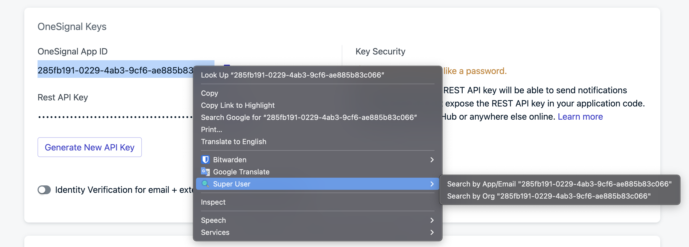
2.   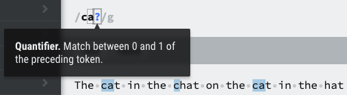
3.   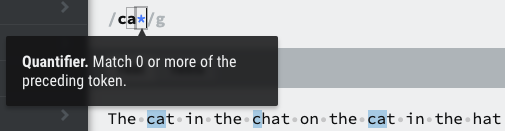
4.   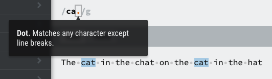
5.   
6.   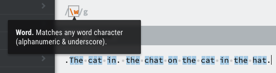
* Switching to capital finds everything all non-word characters (.,; " etc.)
7.   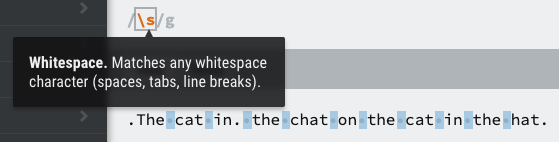
* Switching to captial 'S' finds all non whitespace characters
8.   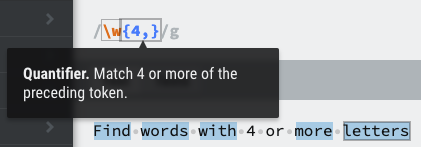
* Add a second number to find a range of letters
9.   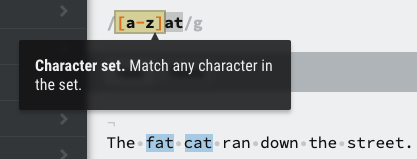
10.   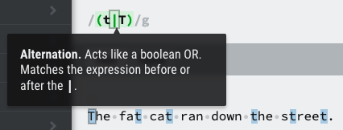
11.   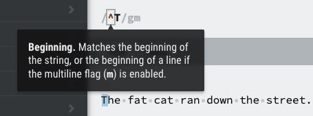
12.   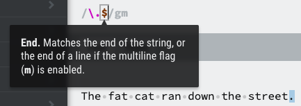
13.   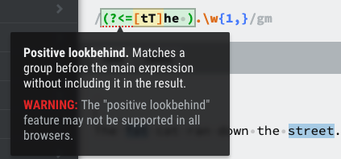
14.   
15.   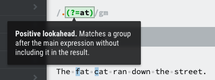
16.   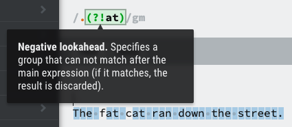
17.   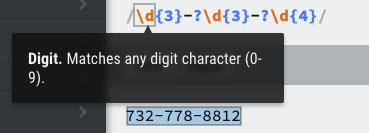
