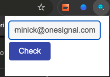
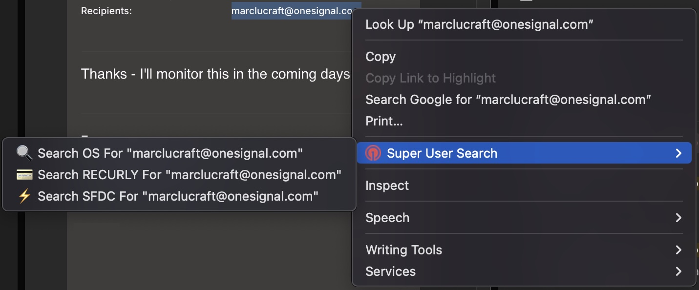

# To install locally
1. Go to [chrome://extensions](chrome://extensions)
2. Turn on developer mode
3. Click "Load Unpacked"
4. Upload the unzipped folder

## How to use this:
- In your chrome extensions you can pin this to the tool bar for frequent use
- Clicking the extension will allow you to enter in any OneSignal associated UUID or email, and search it using the super user search function on the OneSignal Dashboard (must be logged in as super user).
**Better yet **
- When on chrome, you can highlight any text containing an email or uuid and search for that string.
- You can now Search Recurly and SFDC from the right click menu.

 ### How it works:
- When highlighting or adding a string into the extension form, it will check the string matches UUID/Email formats via regex.
- Our Super User page will validate all incoming UUID's and Emails and determine what page should be shown to the super user.
- UUID's should be grouped as 32 hexadecimal characters with four hyphens
- Emails are more lenient in requiring only an '@' with some domain string following (w or w/o the "dot extension")
> Examples:  
```
Using the Pinned Extension : 
```

```
Searching Highlighted Text :
```

